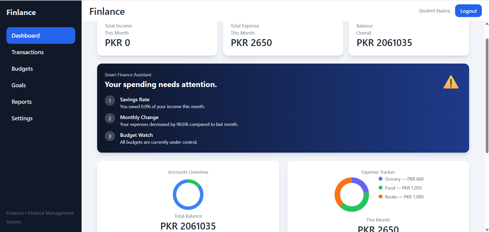
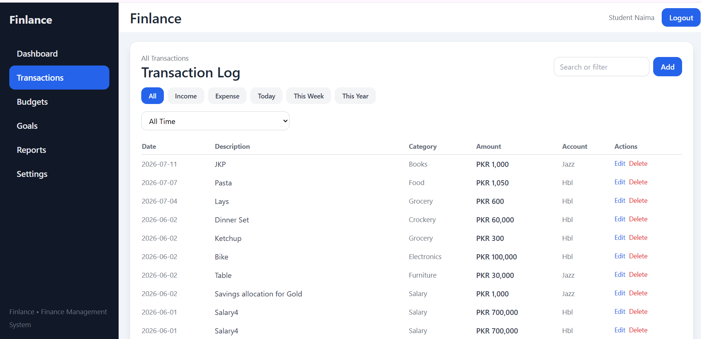

# 💰 Finlance - Full Stack Personal Finance Management System

<p align="center">
  
</p>

<p align="center">
  <strong>A modern full-stack personal finance management platform built with React, FastAPI, and PostgreSQL.</strong>
</p>

<p align="center">


</p>

---

# 📖 Overview

Finlance is a full-stack personal finance management system designed to help users efficiently manage their income, expenses, budgets, and financial insights through a modern web interface.

The project follows a client-server architecture where a React frontend communicates with a FastAPI backend via REST APIs while PostgreSQL securely stores user data.

---

# ✨ Features

- 🔐 Secure JWT Authentication
- 👤 User Registration & Login
- 💰 Income Tracking
- 💸 Expense Management
- 📊 Interactive Dashboard
- 📈 Financial Reports
- 🏦 Budget Management
- 📱 Responsive User Interface
- ⚡ Fast REST APIs
- 📄 Automatic Swagger API Documentation

---

# 🛠 Tech Stack

## Frontend

- React
- JavaScript
- HTML5
- CSS3
- Tailwind CSS *(if used)*
- Axios

## Backend

- FastAPI
- Python
- SQLAlchemy
- Pydantic
- JWT Authentication
- Uvicorn

## Database

- PostgreSQL

---

# 🏗 Architecture

```
                React Frontend
                       │
                       │ REST API
                       ▼
               FastAPI Backend
                       │
                 SQLAlchemy ORM
                       │
                       ▼
                 PostgreSQL Database
```

---

# 📸 Screenshots

## Dashboard


---

## Login Page


---

## Budget Management


---

## Transactions



---

# 📂 Project Structure

```
Finlance-FullStack
│
├── backend
│   ├── app
│   ├── routes
│   ├── models
│   ├── schemas
│   ├── database
│   ├── auth
│   └── main.py
│
├── frontend
│   ├── src
│   ├── components
│   ├── pages
│   ├── hooks
│   └── assets
│
├── images
│
└── README.md
```

---

# 🔑 API Endpoints

| Method | Endpoint | Description |
|---------|----------|-------------|
| POST | `/register` | Register User |
| POST | `/login` | Login |
| GET | `/transactions` | Get Transactions |
| POST | `/transactions` | Add Transaction |
| PUT | `/transactions/{id}` | Update Transaction |
| DELETE | `/transactions/{id}` | Delete Transaction |
| GET | `/budget` | Budget Details |
| POST | `/budget` | Create Budget |

---

# 🚀 Installation

## Clone Repository

```bash
git clone https://github.com/YOUR_USERNAME/Finlance-FullStack.git
```

---

## Backend

```bash
cd backend

pip install -r requirements.txt

uvicorn main:app --reload
```

---

## Frontend

```bash
cd frontend

npm install

npm run dev
```

---

# 📄 API Documentation

FastAPI automatically generates interactive documentation.

Swagger UI

```
http://localhost:8000/docs
```

ReDoc

```
http://localhost:8000/redoc
```

---

# 🔒 Authentication

The backend uses JWT authentication for secure user access.

Protected routes require a valid access token issued after successful login.

---

# 💾 Database

The application uses PostgreSQL with SQLAlchemy ORM to manage relational data efficiently.

Example entities include:

- Users
- Transactions
- Budgets
- Categories

---

# 🎯 Future Improvements

- Email Verification
- Password Recovery
- Export Reports to PDF
- Multi-Currency Support
- Dark Mode
- AI Expense Insights
- Docker Deployment
- CI/CD Pipeline

---

# 👩‍💻 Author

**Naima Khalid**

Software Engineering Student

Backend Developer (Python & FastAPI)

LinkedIn: https://linkedin.com/in/YOUR_PROFILE

GitHub: https://github.com/naimak127-code

---

# ⭐ Support

If you found this project useful, consider giving it a ⭐ on GitHub!
